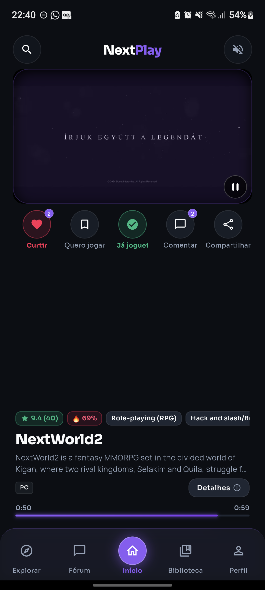

<div align="center">

# 🎮 NextPlay

### Descubra seu próximo jogo.

**Um app de descoberta de jogos em formato de feed vertical.**  
Assista a trailers, descubra títulos fora do óbvio e construa uma biblioteca baseada no seu gosto.

<br>

**Flutter · Dart · Node.js · TypeScript · Fastify · PostgreSQL · Prisma · Firebase**

</div>

---

## 📖 Sobre o NextPlay

Encontrar um jogo novo para jogar nem sempre é fácil.

As lojas possuem milhares de títulos, recomendações costumam repetir os mesmos jogos populares e muitas vezes você acaba passando mais tempo procurando algo interessante do que realmente jogando.

O **NextPlay** nasceu para tornar essa descoberta mais simples.

A proposta é oferecer uma experiência semelhante a um feed de vídeos curtos: o usuário navega verticalmente por jogos, assiste aos trailers e pode rapidamente descobrir títulos que chamam sua atenção.

Conforme utiliza o aplicativo, suas preferências, interações e histórico ajudam a API a construir um feed cada vez mais relevante.

---

## 📱 Preview

<div align="center">



</div>

<p align="center">
  <i>Versão atual do feed do NextPlay em desenvolvimento.</i>
</p>

> A reprodução e disponibilidade dos trailers dependem da mídia disponível para cada jogo e do provedor de vídeo.

---

## ✨ Funcionalidades

| Área | Funcionalidade |
| --- | --- |
| 🎬 **Feed** | Navegação vertical por jogos utilizando trailers e imagens de fallback. |
| 🧠 **Descoberta personalizada** | Recomendações baseadas em preferências, interações e jogos já visualizados. |
| 🔎 **Explorar** | Pesquisa e navegação pelo catálogo disponível. |
| 🎮 **Detalhes do jogo** | Informações, gêneros, plataformas e mídia de cada título. |
| ❤️ **Biblioteca** | Curtidas, favoritos, jogos que deseja jogar, já jogou, notas e avaliações. |
| 💬 **Comunidade** | Estrutura para comentários, discussões e fóruns relacionados aos jogos. |
| 👤 **Conta** | Autenticação e gerenciamento de usuário utilizando Firebase. |
| 🗃️ **Catálogo** | Pipeline de aquisição, validação e atualização de jogos provenientes da IGDB e Steam. |

> O NextPlay ainda está em desenvolvimento. Algumas funcionalidades presentes no repositório continuam em processo de implementação, teste ou refinamento.

---

## 🧠 Como o feed funciona

O NextPlay não foi pensado apenas como uma lista aleatória de jogos.

A API considera informações como:

- preferências de gênero;
- interações do usuário;
- jogos curtidos e favoritados;
- jogos já visualizados;
- histórico da biblioteca;
- qualidade e disponibilidade dos dados do catálogo.

Esses sinais são utilizados para criar uma experiência de descoberta mais personalizada e reduzir a repetição de jogos no feed.

---

## 🏗️ Arquitetura

```text
                       ┌─────────────────┐
                       │   Flutter App   │
                       │   Android/Web   │
                       └────────┬────────┘
                                │
                               HTTP
                                │
                       ┌────────▼────────┐
                       │   Fastify API   │
                       │   TypeScript    │
                       └───┬─────────┬───┘
                           │         │
                         Prisma      │
                           │         │
                  ┌────────▼─────┐   │
                  │ PostgreSQL   │   │
                  └──────────────┘   │
                                    │
                  ┌─────────────────┼─────────────────┐
                  │                 │                 │
             ┌────▼────┐      ┌─────▼─────┐    ┌─────▼─────┐
             │  IGDB   │      │   Steam   │    │ Firebase  │
             │ Catalog │      │   Data    │    │   Auth    │
             └─────────┘      └───────────┘    └───────────┘

O aplicativo utiliza um UUID interno para identificar os jogos.

IDs externos da IGDB e da Steam são mantidos apenas como referências de integração. Isso evita acoplamento da aplicação com provedores externos e permite que diferentes fontes de dados sejam combinadas pelo backend.

🛠️ Tecnologias
Camada	Tecnologias
📱 Aplicativo	Flutter, Dart
⚙️ Backend	Node.js, TypeScript, Fastify
🗄️ Banco de dados	PostgreSQL
🔗 ORM	Prisma
🔐 Autenticação	Firebase Authentication, Firebase Admin
🎮 Dados de jogos	IGDB API, Steam
🎥 Trailers	YouTube
🌐 Comunicação	REST API
📂 Estrutura do projeto
NextPlay/
│
├── lib/                 # Aplicativo Flutter
│   └── features/        # Funcionalidades do aplicativo
│
├── test/                # Testes Flutter
├── assets/              # Recursos do aplicativo
├── android/             # Projeto Android
├── web/                 # Suporte web
│
├── backend/
│   ├── prisma/          # Schema e migrations
│   ├── src/
│   │   ├── modules/     # Módulos da API
│   │   └── scripts/     # Scripts de catálogo e manutenção
│   └── test/            # Testes do backend
│
├── dev.ps1              # Automação do ambiente local
├── pubspec.yaml
└── README.md

O projeto Flutter fica na raiz do repositório, enquanto a API e suas dependências ficam dentro de backend/.

🚀 Executando localmente
Pré-requisitos

Antes de iniciar, tenha instalado:

Flutter 3.38+;
Node.js;
pnpm;
PostgreSQL;
Android SDK ou navegador compatível.

Algumas funcionalidades também exigem credenciais externas para:

Firebase;
IGDB;
Steam.
1️⃣ Backend

Entre na pasta da API:

cd backend

Instale as dependências:

pnpm install --frozen-lockfile

Crie seu arquivo de ambiente:

.env.example → .env

Configure ao menos:

DATABASE_URL=

Dependendo da funcionalidade que deseja testar, também serão necessárias credenciais da IGDB e do Firebase.

⚠️ Nunca publique seu arquivo .env.

Prepare o Prisma:

pnpm run prisma:generate
pnpm run prisma:deploy

Execute a API:

pnpm run dev

A API ficará disponível em:

http://127.0.0.1:3333

Health check:

http://127.0.0.1:3333/health
2️⃣ Aplicativo Flutter

Na raiz do projeto:

flutter pub get
Executar no navegador
flutter run -d edge \
  --dart-define=API_BASE_URL=http://127.0.0.1:3333/api/v1
Executar em dispositivo Android via USB

Primeiro redirecione a porta da API:

adb reverse tcp:3333 tcp:3333

Depois execute:

flutter run -d <id-do-dispositivo> \
  --dart-define=API_BASE_URL=http://127.0.0.1:3333/api/v1

Também existe o script:

./dev.ps1

Com suporte aos modos:

edge
mobile
api

Alguns caminhos de Flutter, Android SDK e JDK dentro do script podem precisar ser ajustados dependendo da máquina.

🧪 Testes e qualidade
Flutter

Na raiz:

flutter analyze
flutter test
Backend

Dentro de backend/:

pnpm run typecheck
pnpm run test

Alguns testes da API dependem de um banco PostgreSQL de teste configurado.

Mais informações estão disponíveis em:

backend/README.md
frontend/README.md
🗃️ Pipeline de catálogo

O backend possui rotinas responsáveis por adquirir, validar e normalizar dados de jogos vindos de fontes externas.

O objetivo não é simplesmente adicionar o maior número possível de jogos, mas manter um catálogo com informações confiáveis e úteis para descoberta.

Entre as verificações realizadas estão:

IGDB / Steam
      │
      ▼
Aquisição de candidatos
      │
      ▼
Validação e deduplicação
      │
      ▼
Verificação de qualidade
      │
      ▼
Normalização dos dados
      │
      ▼
Persistência no PostgreSQL
      │
      ▼
Disponibilização para o Feed

Esse pipeline permite evoluir o catálogo sem depender diretamente dos dados brutos fornecidos pelos provedores externos.

🚧 Estado atual

O NextPlay está atualmente em desenvolvimento ativo.

As principais áreas em evolução são:

qualidade e variedade do catálogo;
personalização das recomendações;
redução de repetição no feed;
correspondência correta entre jogos e trailers;
estabilidade do player;
experiência de navegação mobile;
qualidade dos dados provenientes de fontes externas.

O repositório representa o estado atual do desenvolvimento e não uma versão final pronta para produção.

🎯 Visão do projeto

O objetivo do NextPlay é transformar a maneira como jogadores encontram algo novo para jogar.

Em vez de procurar por horas em lojas, rankings ou listas:

abra o NextPlay, deslize pelo feed e encontre algo que você realmente queira jogar.

👨‍💻 Autores

Idealizado e desenvolvido por:

Lucas Rodrigues
Lucas Rivolta

O histórico completo de desenvolvimento e contribuições pode ser acompanhado através dos commits do repositório.

<div align="center">
🎮 NextPlay

Seu próximo jogo pode estar a um swipe de distância.

</div> ```
